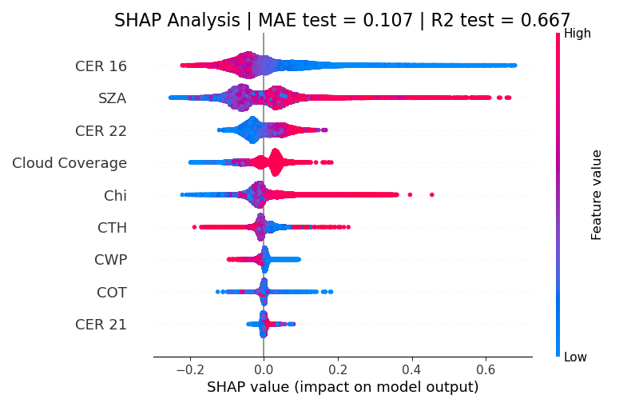

# Cloud Effective Radius Bias Correction Algorithm

## Introduction 

Accurate cloud effective radius (CER) retrievals are essential for understanding how clouds interact with radiation, which directly influences Earth’s energy balance and climate sensitivity. Even small biases in CER can propagate into large uncertainties in climate models and satellite-derived radiative forcing estimates, making improved accuracy critical for reliable climate prediction and atmospheric research. This algorithm aims to correct biases in sensors using the bispectral method, in which horizontal cloud inhomogeneity is typically ignored. The code was developed for NASA’s PACE OCI instrument, with the HARP2 instrument serving as a reference, though it is theoretically applicable to other OCI-like sensors. 

This algorithm was developed by Andrea Poirier during his internship (October 2025 – February 2026) in the Department of Earth Sciences at the Space Research Organisation Netherlands (SRON), under the supervision of Dr. Bastiaan van Diedenhoven.

Contact: A.Poirier@sron.nl or poirier.andrea@outlook.com

## User Manual for Algorithm 

The algorithm is intended to be flexible and used by other users. The structure of the The file `Bias_Correction_Algorithm\utilities\user_input.py` gives the users option for the analysis. Instructions on how to change this file are given here.


<details>
<summary>  Data Storage Location</summary>

This algorithm makes use of the L2 Cloud Optical Properties of OCI/HARP2 or MODIS/HARP2. The algorithm requires data to be saved locally. The data can be downloaded on NASA Search Data engine (url: https://search.earthdata.nasa.gov/) or using `Bias_Correction_Algorithm\data\download_data_from_earthaccess.py`. Once the data is dowloaded locally change accordingly the folder paths. 
```ruby
# Path to OCI L2 data
folder_path_OCI = r"XXX"
# Path to HARP2 L2 data
folder_path_HARP2 = r"XXX"
# Path to MODIS L2 data
folder_path_MODIS = r"XXX"
```

</details>

<details>
<summary>  Definition of Area of Interest </summary>

The algorithm allows for two options. Option 1 is to analyse the entire world. To activate this option change to:

```ruby
# from interactive_rectangle import wgs84_data"
world_data = True
```
Option 2 allows to define a regional area by defining a rectangle with center coordinates and half width of box defined by:

```ruby
center_lat, center_lon = -34, 9
dx = 2.5
```

</details>


<details>
<summary>  Definition of Temporal Range </summary>

For the temporal range, the algorithm allows for two options. Option 1 is to analyze data from all available dates. To turn on this option change this:

```ruby
day_data = False
```
The second option perform the analysis for a specified number of days 'n_days' after the a certain date 'start_day' with format YYYYMMDD. To use this option change:
```ruby
day_data = True
n_days = 1
start_day = '20250809' 
```

</details>


<details>
<summary>  Definition of Other Analysis Options </summary>

There are various option the algorithm supports for the analysis. The algortihm computes the cloud inhomogeneity parameter (chi) and scaling factor in a sliding window way (see report). The size (in degrees) of the square around the pixel of interest can be changed with this line:
```ruby
box_width_for_chi_and_SF_computation = 0.5
```
Additionally, to have a reasonable estimate of the aforementioned parameters, a minimum number of points inside the box is specified. If there are less data points than 'min_neighbors' then the code skips this pixel:

```ruby
min_neighbors = 30
```
As mentionned before, this algorithm is build with the intent of handling large datasets. There is one intermediate option of randomly sampling the data by changing: 'sample_fraction_files' is the fraction of locally saved .nc files the code processes. 

```ruby
sample_fraction_files = 0.07
```
To avoid RAM memory issues, the processing of the data performs is done in chunks and blocks (for `Bias_Correction_Algorithm\processing\OCI.py` only). The data is loaded to the ram memory in chunks, and its computation is done in blocks. Additionally, to avoid loss of computation, intermediate saving is performed by the code every 'save_every_n_blocks'.

```ruby
# Block size in Bias_Correction_Algorithm\processing\OCI.py
block_size = 30_000

# OCI chunk size
OCI_chunk_size = 300_000

# HARP2 chunk size
HARP2_chunk_size = 600_000

# MODIS chunk size
MODIS_chunk_size = 30_000

# Save to disk every N blocks 
save_every_n_blocks = 5 

```
</details>


## Required libraries 

- `cartopy`
- `datetime`
- `gc`
- `h5py`
- `itertools`
- `joblib`
- `lightgbm`
- `matplotlib`
- `mpl_toolkits`
- `netCDF4`
- `numba`
- `numpy`
- `pandas`
- `pyproj`
- `scipy`
- `sklearn`
- `torch`
- `tqdm`